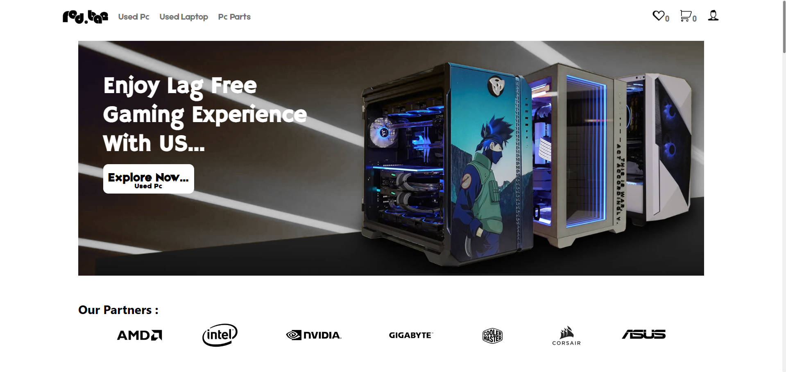
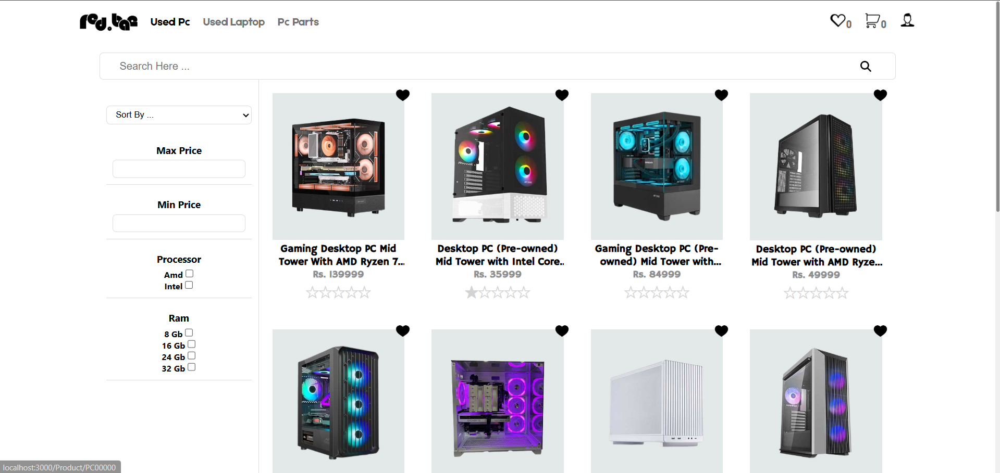
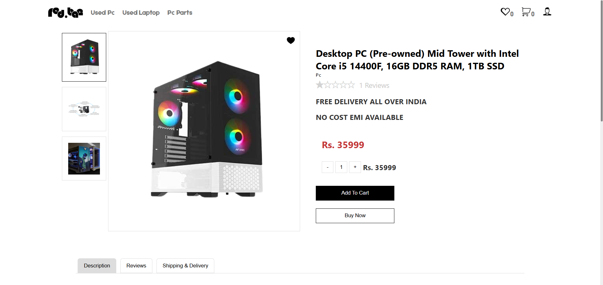
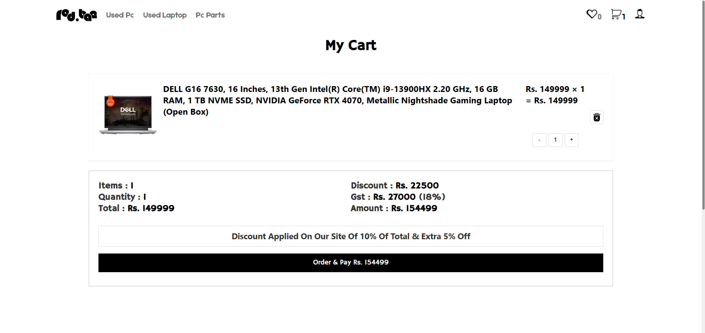

# 🖥️ Red.Bae – E-Commerce for Used PCs, Laptops & PC Parts

Welcome to **Red.Bae**, a full-stack E-Commerce web application built with **React** and **JSON Server**, designed to buy and sell used PCs, laptops, and PC parts with ease.

---

## 🚀 Features

### ✅ 1. User Authentication

- 🔐 Register & Login with secure user session.
- 👑 Admin and User roles are separated.
- 🧠 Sessions stored in **LocalStorage**.
- 🚫 Unauthenticated users cannot add to cart or checkout.
- 🔓 Logout clears cart, wishlist, and session.

---

### 🛒 2. Product Listing & Search

- 📦 Fetch products from JSON Server.
- 🔎 Real-time search filtering by product title.
- 🗂️ Category-based filtering (e.g., Sports, Casual, Formal).
- ⬇️ Sorting options (Price: Low to High, High to Low, Newest).
- 🛑 Duplicate product prevention.

---

### 🧾 3. Product Details Page

- 📘 View detailed product info: name, description, price, category, image.
- 🔢 Select quantity before adding to cart.
- ⭐ Add reviews and ratings for each product.
- 📊 Live average rating calculation per product.

---

### 🛍️ 4. Cart Functionality

- 🧑 Each user has a separate cart.
- ♻️ Persisted across sessions using LocalStorage.
- ➕ Increment/decrement item quantity.
- ❌ Remove items individually.
- 💰 Real-time total price calculation.
- 🔐 Add to cart restricted to logged-in users.

---

### 💳 5. Checkout & Payment

- 🧾 Dummy checkout flow to simulate payment.
- ✅ After payment:
  - Empties cart
  - Saves order to order history
  - Displays success message

---

## ⭐ Bonus Features

- ⭐ Add product ratings and written reviews
- 📊 Dynamically update average ratings
- 🖼️ Datalist product suggestions
- ✨ Animated alerts


---

## 🖼️ Screenshots

### 🏠 Homepage  
A clean and responsive landing page showing featured products and navigation.



---

### 🛍️ Products Page  
Browse all available used PCs, laptops, and parts. Includes search, sort, and filters.



---

### 🔍 Product Detail Page  
Shows product description, pricing, images, and review options.



---

### 🛒 Cart Page  
Displays items added to the cart with quantity controls and total cost.



---

## 🛠️ Tech Stack

- **Frontend:** React, CSS, Axios  
- **Backend:** JSON Server  
- **State:** React Hooks, LocalStorage  
- **Routing:** React Router  
- **Icons & UI:** Custom + External Icon Packs  

---

## 🏁 Getting Started

1. **Clone the repository**
   ```bash
   git clone https://github.com/Yahya-Riswan/red-bae.git
   cd red-bae
