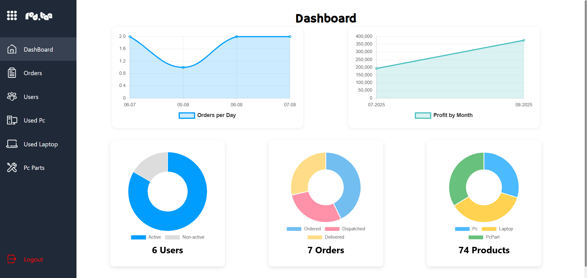

# 🖥️ Red.Bae – E-Commerce for Used PCs, Laptops & PC Parts

Welcome to **Red.Bae**, a full-stack E-Commerce web application built with **React** and **JSON Server**, designed to buy and sell used PCs, laptops, and PC parts with ease.

---

## 🚀 Features

### ✅ 1. User Authentication

- 🔐 Register & Login with secure user session.
- 👑 Admin and User roles are separated.
- 🔒 Protected Routes for different user roles.
- 🧠 Sessions stored in **LocalStorage**.
- 🚫 Unauthenticated users cannot add to cart or checkout.
- 🔓 Logout clears cart, wishlist, and session.

---

### 🛒 2. Product Listing & Search

- 📦 Fetch products from JSON Server.
- 🔎 Real-time search filtering by product title.
- 🗂️ Category-based filtering (e.g., Graphics Cards, RAM, HDD, etc.).
- ⬇️ Sorting options (Price: Low to High, High to Low, Newest).
- 🛑 Duplicate product prevention.

---

### 🧾 3. Product Details Page

- 📘 View detailed product info: name, description, price, category, image.
- 🔢 Select quantity before adding to cart.
- ⭐ Add reviews and ratings for each product.
- 📊 Live average rating calculation per product.

---

### 🛍️ 4. Cart Functionality

- 🧑 Each user has a separate cart.
- ♻️ Cart persisted across sessions using LocalStorage.
- ➕ Increment/decrement item quantity.
- ❌ Remove items individually.
- 💰 Real-time total price calculation.
- 🔐 Add to cart restricted to logged-in users.

---

### 💳 5. Checkout & Order Management

- 🧾 Dummy checkout to simulate payment.
- ✅ After payment:
  - Cart is emptied.
  - Order saved to order history.
  - Success message shown.

---

## 🧑‍💼 Admin Panel

### 🧠 6. Admin Dashboard

- 📊 View statistics: total users, total orders, total products, reviews.
- 📈 Graphs using Chart.js:
  - Orders per day
  - Sales volume
  - New user signups
- 🔎 Filter stats by date range or month.

### ➕ 7. Admin Management Tools

- ➕ Add new products via admin panel.
- ✏️ Edit existing product details.
- ❌ Soft Delete products (set `isDeleted: true` instead of removing).
- 👤 Add users with custom roles (admin/user).
- 🗑️ Soft delete users to revoke access without full deletion.
- 🔄 Restore soft-deleted users or products.

---

## 🌐 Protected Routes

- 🔒 Routes are guarded based on role:
  - `/admin/*` routes only accessible by admins.
  - `/cart`, `/checkout`, `/orders` only for logged-in users.

---

## ⭐ Bonus Features

- 🌟 Product reviews with star rating.
- 📉 Datalist suggestions in search bar.
- ✨ Animated toast alerts for actions.
- 📧 Email-like admin notifications.
- 🎯 Mobile responsive with adaptive design.

---

## 🖼️ Screenshots

### 🏠 Homepage  


### 🛍️ Products Page  


### 🔍 Product Detail Page  


### 🛒 Cart Page  


### 📊 Admin Dashboard  


---

## 🛠️ Tech Stack

- **Frontend:** React, CSS, Axios  
- **Backend:** JSON Server  
- **State Management:** React Hooks, Context API, LocalStorage  
- **Routing:** React Router v6  
- **Data Viz:** Chart.js  
- **Icons/UI:** Custom SVGs + External Packs (e.g., FontAwesome)

---

## 🏁 Getting Started

1. **Clone the repository**
   ```bash
   git clone https://github.com/Yahya-Riswan/red-bae.git
   cd red-bae
